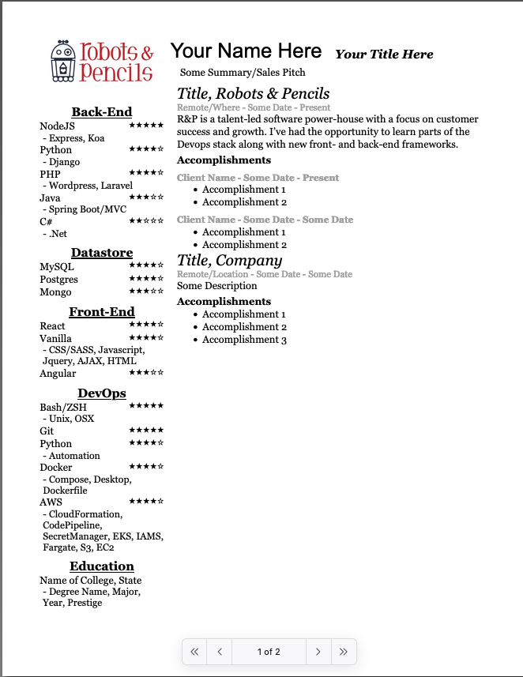

# Resume Generator

## How to use

1. Clone project to your computer
1. Using a text editor or IDE, open the following files and fill in the data:
- demographics.js
- experiences.js
- skills.js
1. Open `index.html` in your browser, and print to PDF.
